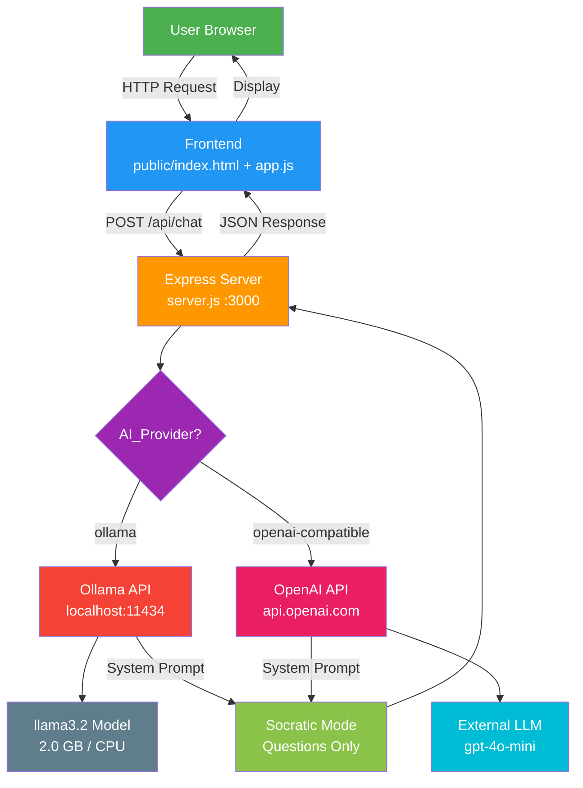
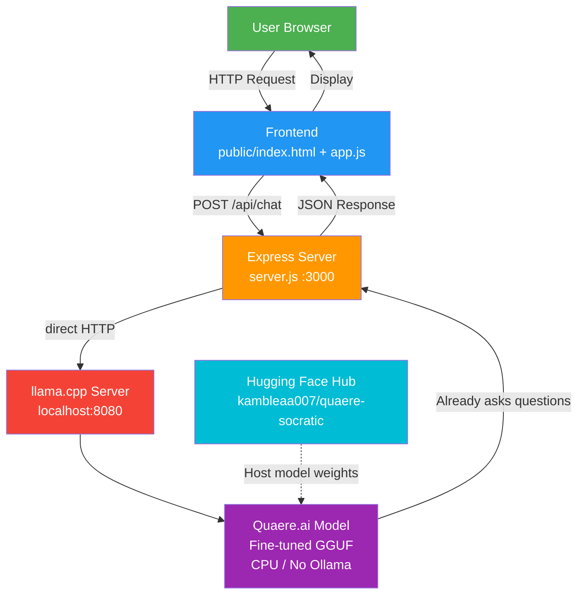

# Architecture Diagram — Quaere.ai (Custom Model)

## Current State (before fine-tuning)



## Target State (after fine-tuning)



## Component Descriptions

| Component | Role |
|-----------|------|
| **User Browser** | End-user interface; submits questions |
| **Frontend** | Static HTML/JS served by Express; sends chat requests |
| **Express Server** | Central hub; routes to AI provider |
| **llama.cpp Server** | Inference engine; serves fine-tuned GGUF directly |
| **Quaere.ai Model** | Custom fine-tuned model hosted on Hugging Face; asks questions only |
| **Hugging Face Hub** | Model repo: `kambleaa007/quaere-socratic`; hosts weights |
| **ngrok** | Optional tunnel to expose localhost:8080 publicly |
| **Socratic Mode** | Behavior baked into model weights (not just a prompt) |

## Data Flow (Current — Default)

1. User types question in browser
2. Frontend sends `POST /api/chat` with message array to Express server
3. Server checks `AI_PROVIDER` environment variable
4. **If huggingface**: forwards to `https://api-inference.huggingface.co/models/kambleaa007/quaere-socratic` with API key → model responds
5. **If openai-compatible**: forwards to Groq API with `GROQ_API_KEY` → model responds (fallback)
6. **If ollama**: forwards to `localhost:11434/api/chat` → llama3.2 responds (local only)
7. Server returns JSON `{ reply }` to frontend
8. Frontend displays reply to user

## Data Flow (Target — Post Fine-Tune)

1. User types question in browser
2. Frontend sends `POST /api/chat` to Express server
3. Server forwards directly to llama.cpp server endpoint (`localhost:8080`)
4. **Fine-tuned Quaere.ai Model** responds — inherently asks questions (no system prompt needed)
5. Server returns JSON `{ reply }` to frontend
6. Frontend displays reply to user

## Request Flow (Hugging Face API — Current Default)

```
User Browser
  │ POST /api/chat
  │ { "messages": [{"role":"user","content":"hi"}, ...] }
  ▼
Express Server (quaere-ai.onrender.com)
  │ reads env: AI_PROVIDER=huggingface
  ▼
callHuggingFace(messages)
  │ POST https://api-inference.huggingface.co/models/kambleaa007/quaere-socratic
  │ Headers: Authorization: Bearer hf_xxxxx
  │ Body: { "inputs": [{role:"system",content:"..."}, ...messages], ... }
  ▼
Hugging Face Inference API
  │ Loads fine-tuned GGUF from Hub
  │ Runs model on HF infrastructure
  ▼
{ "reply": "What troubles your mind?" }
  ▼
Express Server → JSON { reply } → Browser
  │
  ▼
Frontend displays Socratic question to user
```

### Code Path in server.js
| Step | Function | Line |
|---|---|---|
| Receive request | `app.post('/api/chat')` | 101 |
| Check provider | `provider === 'huggingface'` | 116 |
| Call HF API | `callHuggingFace(messages)` | 69 |
| Parse response | `data.generated_text` | 96 |
| Return to client | `res.json({ reply })` | 122 |

### Env Vars Required
| Variable | Example | Required |
|---|---|---|
| `AI_PROVIDER` | `huggingface` | Yes (triggers HF path) |
| `HF_MODEL_ID` | `kambleaa007/quaere-socratic` | Yes |
| `HF_API_KEY` | `hf_xxxxx` | Yes |
| `HF_ENDPOINT` | *(optional, default uses model ID)* | No |

## Optional: Public Access via ngrok
- Tunnel `localhost:8080` to a public URL
- Allows external access to your model
- Uses existing ngrok setup (`ngrok_TOKEN` in project)

## Deployment Stack

```
Google Colab (train) → Hugging Face Hub (host) → Render (serve website) → User Browser
                                           │
                                    ┌──────┴──────┐
                                    │             │
                              HF Inference   llama.cpp (local)
                              (Path A)       (Path B)
                              (API call)     (ngrok tunnel)
                                    │             │
                                    └──────┬──────┘
                                           ▼
                                   Fine-tuned GGUF
                                   kambleaa007/quaere-socratic
```

### Current (Live)
- **Website**: `https://quaere-ai.onrender.com/`
- **Backend**: Node.js server on Render (same service)
- **AI Provider**: Currently `openai-compatible` (Groq `llama-3.3-70b-versatile`)
- **Config**: Set in Render Dashboard → Environment Variables

### Post-Training (Connect Website to Custom Model)
1. Upload GGUF to `kambleaa007/quaere-socratic` on HF Hub
2. Go to Render Dashboard → `quaere-ai` service → Environment
3. Update variables:
   ```
   AI_PROVIDER=huggingface
   HF_MODEL_ID=kambleaa007/quaere-socratic
   HF_API_KEY=hf_your_token_here
   ```
4. Render auto-redeploys → Website now serves your custom Socratic model
5. Colab can be closed — not connected to live website

### Path A — Hugging Face Inference API (Easiest)
- No local setup needed
- Render calls HF API directly
- Free tier (rate-limited)
- Just set env vars

### Path B — llama.cpp (Your Plan)
- Download GGUF → run `llama-server` on `localhost:8080`
- Expose via ngrok (`ngrok_TOKEN` in project)
- Point Render to ngrok URL OR use HF API instead
- Full control, your hardware

---

## Key Change
- **Before**: Ollama API → System Prompt → llama3.2 (general model, prompted to ask questions)
- **After**: Hugging Face Hub → llama.cpp → Fine-tuned weights → Quaere.ai Model (trained to ask questions)
- **No Ollama API involved at all**
- **Model hosted on**: [https://huggingface.co/kambleaa007/quaere-socratic](https://huggingface.co/kambleaa007/quaere-socratic)
